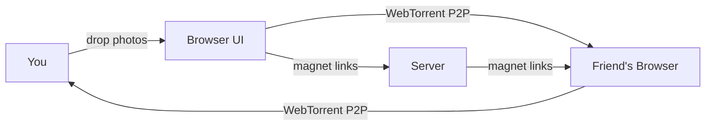
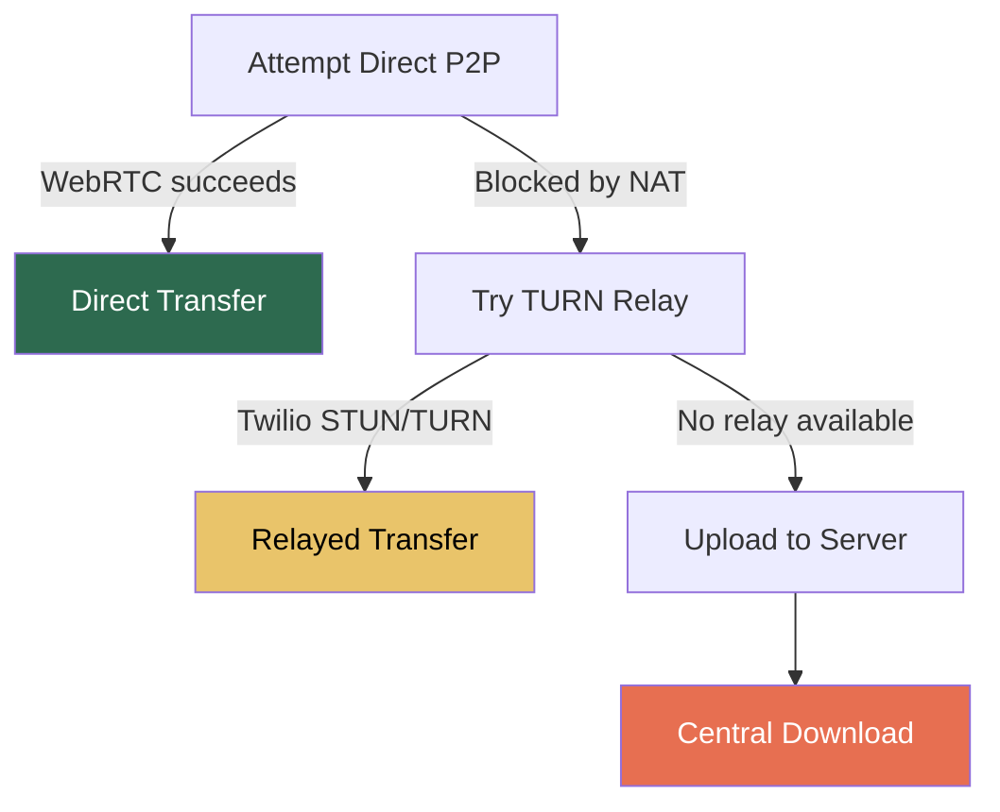
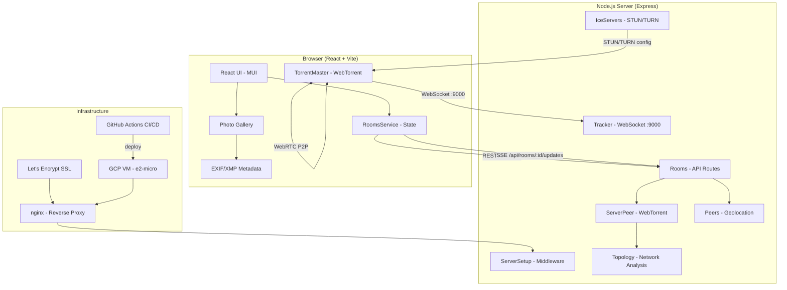

# PhotoGroup

**Zero-install, peer-to-peer, lossless photo sharing in your browser.**

PhotoGroup lets groups share original, full-quality photos directly between browsers using [WebTorrent](https://github.com/webtorrent/webtorrent) (WebRTC). No accounts, no compression, no app to install.

> **Status:** Experimental
> **Live:** [photogroup.network](https://photogroup.network)
> **License:** MIT

---

## How It Works



1. **Create a room** -- get a shareable link or QR code
2. **Drop photos** -- files are shared as torrents via WebRTC
3. **Peers join** -- they get photos directly from your browser (P2P)
4. **Metadata preserved** -- EXIF & XMP data extracted and displayed

### P2P Fallback Strategy

Not all networks allow direct peer connections. PhotoGroup gracefully degrades:



| Mode | Speed | Privacy | When |
|------|-------|---------|------|
| **Direct P2P** | Fastest | Photos never touch server | Open NATs, same network |
| **TURN Relay** | Good | Encrypted relay via Twilio | Symmetric NAT |
| **Server Upload** | Varies | Server stores temporarily | All else fails |

---

## Architecture



### API Endpoints

| Method | Endpoint | Purpose |
|--------|----------|---------|
| `POST` | `/api/rooms/` | Create a new room |
| `GET` | `/api/rooms/:id` | Get room details |
| `POST` | `/api/rooms/:id` | Join a room |
| `POST` | `/api/rooms/:id/photos/` | Upload a photo |
| `PUT/DELETE` | `/api/rooms/:id/photos/*` | Manage photos |
| `POST` | `/api/rooms/:id/connections` | Report P2P connection |
| `GET` | `/api/rooms/:id/updates/` | SSE live updates |
| `GET` | `/api/__rtcConfig__` | Get ICE server config |

---

## Project Structure

```
photogroup2/
├── server/                  # Express API + WebTorrent server
│   ├── app.js               # Entry point (port 8081)
│   ├── ServerSetup.js       # Middleware, static serving, security headers
│   ├── Rooms.js             # Room CRUD, photo management, SSE
│   ├── Peers.js             # Peer tracking + IP geolocation
│   ├── ServerPeer.js        # Server-side WebTorrent client
│   ├── Tracker.js           # BitTorrent tracker (WebSocket :9000)
│   ├── IceServers.js        # Twilio STUN/TURN integration
│   ├── Topology.js          # P2P connection analysis
│   ├── IpTranslator.js      # IP enrichment + country flags
│   └── tests/               # Unit, API, integration tests (Mocha)
├── ui/                      # React frontend
│   ├── src/
│   │   ├── App.js           # Root component (theme, layout)
│   │   ├── share/
│   │   │   ├── ShareCanvas.js      # Main photo sharing canvas
│   │   │   ├── RoomsService.js     # State + API client
│   │   │   ├── torrent/            # WebTorrent browser client
│   │   │   ├── gallery/            # Photo grid + display
│   │   │   ├── metadata/           # EXIF/XMP extraction
│   │   │   ├── header/             # Nav, settings, uploader
│   │   │   ├── topology/           # Network visualization
│   │   │   └── security/           # Encryption features
│   │   └── compatibility/          # Node.js polyfills for browser
│   ├── e2e/                 # Playwright end-to-end tests
│   └── vite.config.js       # Build config (proxies /api to :8081)
├── .github/workflows/       # CI/CD (test.yml, deploy.yml)
├── Dockerfile               # Multi-stage production build
├── Dockerfile.dev           # Development with hot reload
├── docker-compose.yml       # Production compose
├── docker-compose.dev.yml   # Development compose
└── *.sh                     # Deployment scripts (GCP)
```

---

## Quick Start

**Requirements:** Node.js >= 24.0.0

```bash
git clone https://github.com/acuhl/photogroup2.git
cd photogroup2
npm run install-start
```

| Service | URL | Port |
|---------|-----|------|
| **UI** (Vite dev server) | http://localhost:3000 | 3000 |
| **API Server** (Express) | http://localhost:8081 | 8081 |

The UI auto-proxies `/api` requests to the server.

### With Docker

```bash
# Production
docker-compose up -d

# Development (hot reload)
docker-compose -f docker-compose.dev.yml up
```

See [DOCKER.md](DOCKER.md) for full Docker documentation.

### Optional: Twilio (NAT Traversal)

For STUN/TURN relay support, add Twilio credentials via one of:

- `server/secret/index.js` (tried first)
- `server/secret.js`
- Environment variables: `TWILIO_ACCOUNT_SID`, `TWILIO_AUTH_TOKEN`

```js
// server/secret/index.js
export default {
  twilio: {
    accountSid: 'AC...',
    authToken: '...'
  }
};
```

Without Twilio, the app still works with standard WebRTC (direct P2P only).

---

## Tech Stack

| Layer | Technology |
|-------|------------|
| **Frontend** | React 19, Vite, Material-UI (MUI) |
| **P2P** | WebTorrent, WebRTC, simple-peer |
| **Backend** | Node.js 24, Express 5 (ES modules) |
| **Real-time** | Server-Sent Events (SSE), WebSocket tracker |
| **Metadata** | exifr (EXIF/XMP extraction) |
| **Testing** | Vitest (UI), Mocha + Supertest (server), Playwright (E2E) |
| **Deploy** | Docker, GCP VM, nginx, Let's Encrypt, GitHub Actions |

---

## Testing

```bash
# Run all tests
npm test

# UI unit tests only
cd ui && npm test

# Server tests only
cd server && npm test

# End-to-end (Playwright)
cd ui && npm run test:e2e
```

See [TEST_COVERAGE.md](TEST_COVERAGE.md) for detailed test documentation.

---

## Deployment


Production runs on a GCP e2-micro VM with Docker, nginx reverse proxy, and Let's Encrypt SSL.

See [DEPLOYMENT.md](DEPLOYMENT.md) for full deployment guide including GCP setup, DNS, SSL, and CI/CD configuration.

---

## Environment Variables

| Variable | Default | Purpose |
|----------|---------|---------|
| `PORT` | `8081` | Server HTTP port |
| `WS_PORT` | `9000` | WebSocket tracker port |
| `WS_HOST` | `127.0.0.1` | WebSocket bind host (`0.0.0.0` in Docker) |
| `NODE_ENV` | `development` | Environment mode |
| `TWILIO_ACCOUNT_SID` | -- | Twilio account for TURN/STUN |
| `TWILIO_AUTH_TOKEN` | -- | Twilio auth token |
| `ENABLE_IP_LOOKUP` | `true` | Enable peer geolocation |

---

## Credits

Built on the work of:
- [WebTorrent](https://github.com/webtorrent/webtorrent) -- P2P in the browser
- [Instant.io](https://github.com/webtorrent/instant.io) -- WebTorrent file sharing
- [exifr](https://github.com/nickytonline/exifr) -- EXIF/XMP metadata extraction

Additional inspiration:
- [webtorrent-examples/resurrection](https://github.com/SilentBot1/webtorrent-examples/blob/master/resurrection/index.js)
- [webtorrent#1412](https://github.com/webtorrent/webtorrent/issues/1412)

### Note on parse-torrent

This app uses [parse-torrent](https://github.com/webtorrent/parse-torrent) recompiled for browser use:
`browserify -s parsetorrent -e ./ -o parsetorrent.js`
The recompiled version is in `ui/public/parsetorrent.js`.
